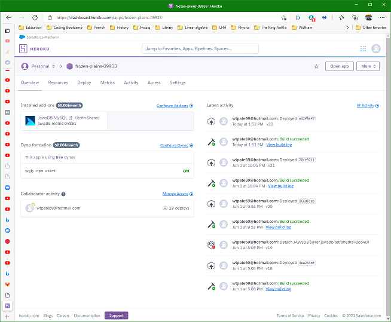
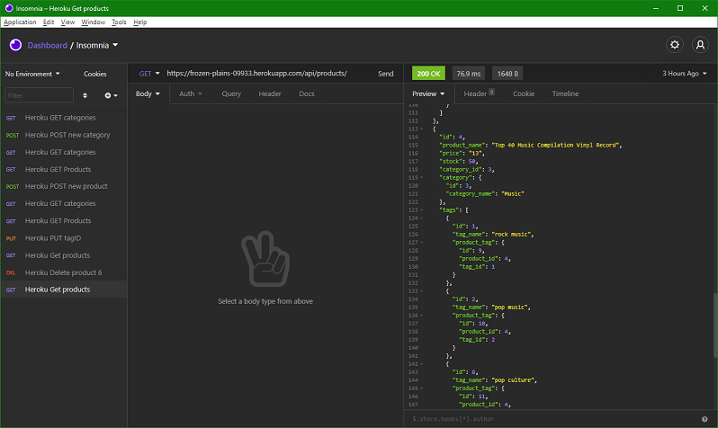

# 13-E-Commerce-Backend
## Description
This project is a server/backend for a ficticious e-commerce website using Sequelize. The database is mySql on localhost and JawsDB on Heroku. The database has 3 tables: Category, Product and Tag. A category can have many products (one-to-many). A product can belong to only one category. A product can have many tags (many-to-many).

The api routes can be tested with Insomnia. The following mp4 file is a video of several api operations in Insomnia.  
(https://github.com/minprocess/13-E-Commerce-Backend/blob/main/video/demonstration_of_backend_on_heroku_using_insomnia.mp4)  
Note that the video is in a folder names Video.

Most of the code was written by the company that runs the Univeristy of Pennsylvania coding boot camp.

This app was deployment to Heroku as the following  
https://ecomm-backend-2542.herokuapp.com/

The mySQL and JawsDB databases can be seeded with this app. See the Usage section below.

When this server is started the Sequelize models are synced to the MySQL database on the localhost or to the JawsDB on Heroku.  

## Installation
This project has repositories on Heroku and on GitHub. The git command to show remote repositories is  
`git remote -v`  
Git returned the following  
```
heroku  https://git.heroku.com/ecomm-backend-2542.git (fetch)  
heroku  https://git.heroku.com/ecomm-backend-2542.git (push)  
origin  git@github.com:minprocess/13-E-Commerce-Backend.git (fetch)  
origin  git@github.com:minprocess/13-E-Commerce-Backend.git (push)  
```
This project has the following dependencies in `package.json`.
```
    "dotenv": "^8.2.0",
    "express": "^4.17.1",
    "mysql2": "^2.1.0",
    "sequelize": "^5.21.7"
```

## Usage
The following commands deploy to Heroku. Note that the Heroku CLI has to be installed on the PC with source code for this project.  
`heroku create`
`git push heroku main`

This server/backend works with mySQL on the PC used for development or on Heroku.

To seed the database on the development PC use one of the following commands  
`node seeds/index.js`  
`npm start seeds/index.js`

To seed the database on Heroku use this command  
`heroku run node seeds/index.js`

To start this server on Heroku, click the Start App button in the page f

Insomnia can be used to perform CRUD operations with the database. Below are the 3 routes that can be used in Insomnia  
```
https://ecomm-backend-2542.herokuapp.com/api/categoriesgit /
https://ecomm-backend-2542.herokuapp.com/api/products/
https://ecomm-backend-2542.herokuapp.com/api/tags/
```
The following mp4 file is a video of several api operations in Insomnia  
(https://github.com/minprocess/13-E-Commerce-Backend/blob/main/video/demonstration_of_backend_on_heroku_using_insomnia.mp4)


| SQL | Method | API | Data |
| --- | --- | --- | --- |
| Read categories | GET | https://ecomm-backend-2542.herokuapp.com/api/categories |  |
Create a category | POST | https://ecomm-backend-2542.herokuapp.com/api/categories | { "category_name":"Sports" } |
| Read products | GET | https://ecomm-backend-2542.herokuapp.com/api/products |   |
| Create a product | POST | https://ecomm-backend-2542.herokuapp.com/api/products | { "product_name":"Basketball", "price":200.00, "stock":3, "category_id":6, "tagIds":[1,2]} |
| Update a product | PUT | https://ecomm-backend-2542.herokuapp.com/api/products/6 | { "tagIds":[3,4] }} |
| Delete a product | DELETE | https://ecomm-backend-2542.herokuapp.com/api/products/6 |   |

<br><br>
The figure belows shows what the Heroku web page for this ecommerce server looks like.  


<br>
<br>
The figure below shows what the Insomnia interface looks like with saved requests in the left hand panel, an api request in the middle and the result in the right hand panel.  


## Credits
Most of the code was written by the company that runs the Univeristy of Pennsylvania coding boot camp. The routes and models were written by me with help from comments in the js files.

The following article was very helpfule writing the many-to-many sequelize associations for product and tags.

## MIT License

Copyright (c) 2021 William Pate

Permission is hereby granted, free of charge, to any person obtaining a copy
of this software and associated documentation files (the "Software"), to deal
in the Software without restriction, including without limitation the rights
to use, copy, modify, merge, publish, distribute, sublicense, and/or sell
copies of the Software, and to permit persons to whom the Software is
furnished to do so, subject to the following conditions:

The above copyright notice and this permission notice shall be included in all
copies or substantial portions of the Software.

THE SOFTWARE IS PROVIDED "AS IS", WITHOUT WARRANTY OF ANY KIND, EXPRESS OR
IMPLIED, INCLUDING BUT NOT LIMITED TO THE WARRANTIES OF MERCHANTABILITY,
FITNESS FOR A PARTICULAR PURPOSE AND NONINFRINGEMENT. IN NO EVENT SHALL THE
AUTHORS OR COPYRIGHT HOLDERS BE LIABLE FOR ANY CLAIM, DAMAGES OR OTHER
LIABILITY, WHETHER IN AN ACTION OF CONTRACT, TORT OR OTHERWISE, ARISING FROM,
OUT OF OR IN CONNECTION WITH THE SOFTWARE OR THE USE OR OTHER DEALINGS IN THE
SOFTWARE.